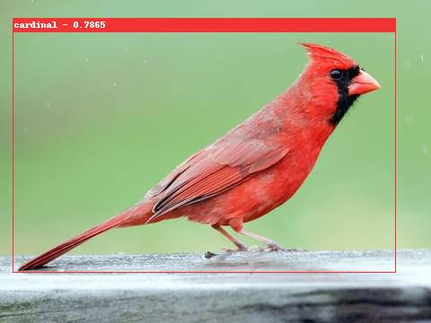

# Box My Image

It's a Google Cloud function.

Send it a get request with an image url and some box co-ordinates and it will return a jpg with a box drawn on it.

```
GET http://localhost:8080/box_my_image?image_url=https%3A%2F%2Fstorage.googleapis.com%2Fbird-feeder%2F5a29a740-5ecc-11ea-bb73-2b6c24b84863_63667361-480px.jpg&top=35&left=14&right=440&bottom=303&name=cardinal+-+0.7865
```

Response



## Querystring parameters

 - **image_url**: url encoded url of an image
 - **top**: top position of the box
 - **bottom**: bottom position of the box
 - **left**: left position of the box
 - **right**: right position of the box
 - **name**: a title for the box

## Run it locally:

Start a virtual env:

`source venv/bin/active`

Restore the dependencies;

`pip install -r requirements.txt`

run it up

`functions-framework --target box_my_image`

## Deployment

Deploy it to google cloud...

`gcloud functions deploy box_my_image --runtime python37 --trigger-http --allow-unauthenticated`

Sweet
